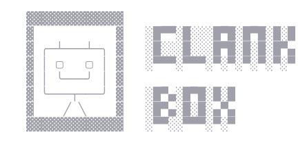

# clankbox



A container for safer vibecoding. Runs [opencode](https://opencode.ai) in a reusable podman container bound to your current directory.

## Why run opencode in a container?

An autonomous agent runs shell commands and edits files with your real credentials. A container bounds the blast radius:

- **Filesystem scope.** The agent sees only the bind-mounted workspace, not your whole home directory or other projects. Sensitive host paths (for example `~/.ssh`, `/proc`, runtime dirs) are rejected.
- **Credential exposure is bounded.** Host auth is mounted read-only, private SSH keys are not mounted, and only specific API key env vars are forwarded at exec time. Network is enabled, so the agent can still exfiltrate what it can read.
- **`sudo` without host-root privileges.** Passwordless sudo inside the container maps to your unprivileged host user under rootless podman, not real root. Rootful podman is refused.
- **Git hooks and config are protected when present.** For a normal repository root (`.git` directory), hooks/config and `.git/modules` admin paths stay read-only while index/objects/refs remain writable so the agent can stage and commit. Git is optional; non-git directories work. Linked worktrees and submodule checkouts used as the workspace root are unsupported for in-container Git.
- **Reversible.** Throw away a bad state with `clankbox rm`; the image is shared and rebuildable.
- **Pinned tools.** Node.js, opencode, and the NVIDIA keyring package use versions and SHA-256 hashes embedded in the launcher. Apt upgrades inside the container remain rolling.

A sandbox is a backstop, not a substitute for judgment. Agents ignore instructions, and workspace writes (Makefiles, scripts, CI configs) can execute on the host outside the container. Review changes before running them on the host. See [Security details](SECURITY.md) for the full picture.

## Requirements

- Python 3.10+
- [podman](https://podman.io/) in **rootless** mode
- network access to build the image and for tools inside the container
- Linux amd64 or arm64 (Node and opencode pins cover these architectures)

## Platforms

Runs on Linux hosts, including Linux guests such as VMs and WSL2 distros (e.g. Ubuntu). On WSL2 or a VM, keep your project on the Linux filesystem (`~/...`) rather than a Windows mount (`/mnt/c/...`) for correct permissions and performance.

## Setting up podman

```bash
sudo apt install podman     # Debian / Ubuntu / WSL
sudo dnf install podman     # Fedora
podman run --rm hello-world
podman info --format '{{.Host.Security.Rootless}}'   # should print true
```

## Install

The launcher is self-contained (Dockerfile and pins are embedded). Copy it onto your `PATH`:

```bash
mkdir -p ~/.local/bin
install -m 0755 ./clankbox ~/.local/bin/clankbox
# ensure ~/.local/bin is on PATH
```

Do not symlink the launcher into a project directory you will sandbox.

### Updating clankbox itself

```bash
git pull
install -m 0755 ./clankbox ~/.local/bin/clankbox   # refresh the installed copy
clankbox build                                     # rebuild image if the base changed
# existing projects:
clankbox update                                    # re-apply pinned Node/opencode
# or after schema changes:
clankbox rm && clankbox init
```

## Usage

```bash
cd /path/to/your/project
clankbox init              # create and provision the container (once per project)
clankbox init --nvidia     # same, plus GPU access and CUDA runtime libraries
clankbox init --x11        # same, plus host X11 display passthrough
clankbox opencode          # start opencode
clankbox oc                # same (alias for 'opencode')
```

`init` builds the image if needed, creates the container, and installs the pinned
Node.js and opencode versions embedded in the launcher.

Containers from older schema versions must be removed and re-created
(`clankbox rm` then `clankbox init`). `rm` accepts legacy schemas so that works.

`init --nvidia` needs host NVIDIA driver and [nvidia-container-toolkit](https://docs.nvidia.com/datacenter/cloud-native/container-toolkit/latest/index.html)
with CDI. `init --x11` needs host `DISPLAY` and uses host networking for SSH `-Y`.

```bash
clankbox list
clankbox df
clankbox stop
clankbox stop --all
clankbox rm
clankbox rm --all
clankbox build
clankbox update
clankbox update --all
clankbox opencode --continue
clankbox oc run "explain this repo"
```

## Concurrent terminals

Advisory locks in `~/.local/state/clankbox/locks` (or `$XDG_STATE_HOME/clankbox/locks`)
serialize image builds and container lifecycle. Sessions can run concurrently after
`podman exec`. `stop` and `rm` can end active sessions by design.

## Image contents

Debian bookworm slim (digest-pinned) plus: git, curl, wget, jq, ripgrep, python3,
make/g++, openssh-client, zip/unzip, sudo.

Node.js and opencode are provisioned at `init`/`update` from pins in the launcher.
Bump pins by editing the `ARTIFACTS` constant, reinstalling the launcher, and
running `clankbox update` (and `clankbox build` if the base image changed).

The `clank` user has passwordless `sudo` inside the container. Under rootless
podman this is isolated from host root. Packages persist until `clankbox rm`.

## Tests

```bash
python3 -B tests/test_clankbox.py
```

See [Design](DESIGN.md) and [Security details](SECURITY.md).
